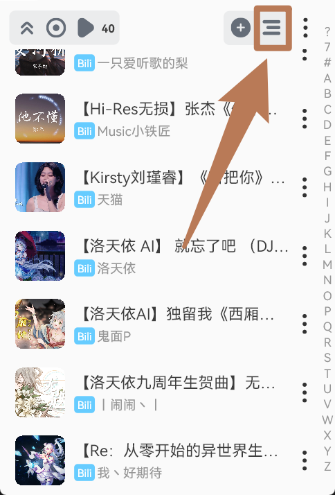

# 选择歌曲到歌单中
- 本页将为您在歌曲列表中如何选择歌曲添加到其他歌单中

## 添加单首歌曲
- 点击列表项右边的`三个点`：

- 然后点击`添加到其他歌单`：

- 最后点击一个`歌单`即可，歌曲将会被添加到所点击的歌单中：

## 批量选择
- 在歌曲列表中点击列表右上角的`三个横线`或`按住任意列表项`:

- 选择歌曲，然后点击列表底部的按钮`更多`：

- 点击`添加到其他歌单`：

- 最后点击一个`歌单`即可，歌曲将会被添加到所点击的歌单中：
