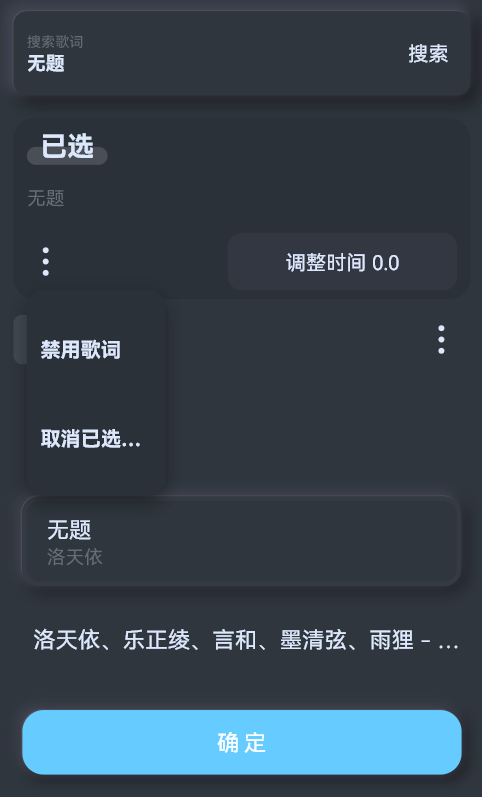
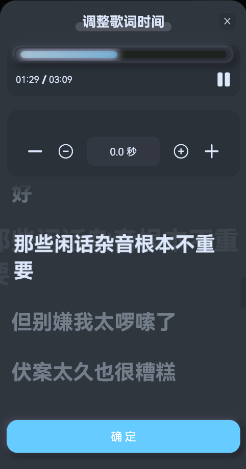

# 绑定云歌词与调整时间

## 在播放页面更换歌词
- 进入播放页面

- ...
- **在播放页面更换歌词会自动同步更改歌单和播放列表内该歌曲的歌词**

## 在歌曲列表绑定歌词
- 进入歌单
- 点击歌曲项右边的`三个点`:

- 点击`绑定歌词`：

- 可以看到已选择的歌词：
  - 歌词绑定状态一共有三种情况：
  - 未选择歌词；播放时依次尝试读取内嵌歌词、外置歌词，都没有则尝试自动匹配歌词
  - 已选择歌词；播放时优先加载选择的歌词，如果没有则按`未选择歌词`时尝试
  - 禁用歌词；不加载任何歌词

- 根据搜索结果点击想要的歌词项：

- 选择后会提示已选歌词，并可以`取消已选歌词`或`调整时间`：

- 最后点击底部的`确定`即可

## 调整歌词时间
- 前面`选择歌词`时您可能已经注意到了`调整时间`功能，下面来看看具体如何调整：
- 在`选择歌词`弹窗中点击`调整实际`：

- 上方有进度条可以调整播放进度，当点击右上角的`播放/暂停`按钮时，会自动切换到当前调整歌词的歌曲。
- 点击歌词行可以跳转播放，以此感受歌词的快慢，然后调整偏移时间即可。
