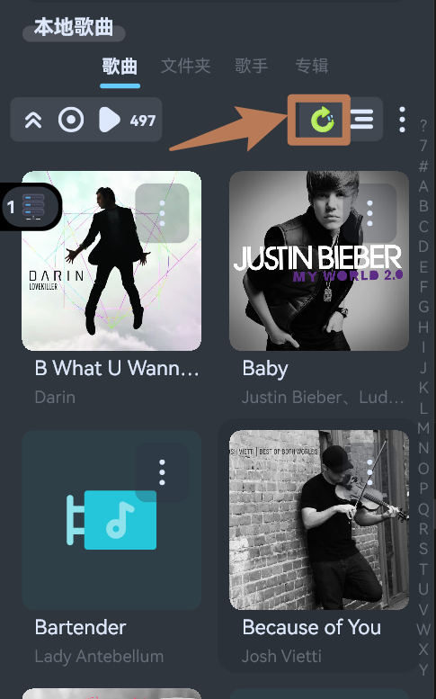
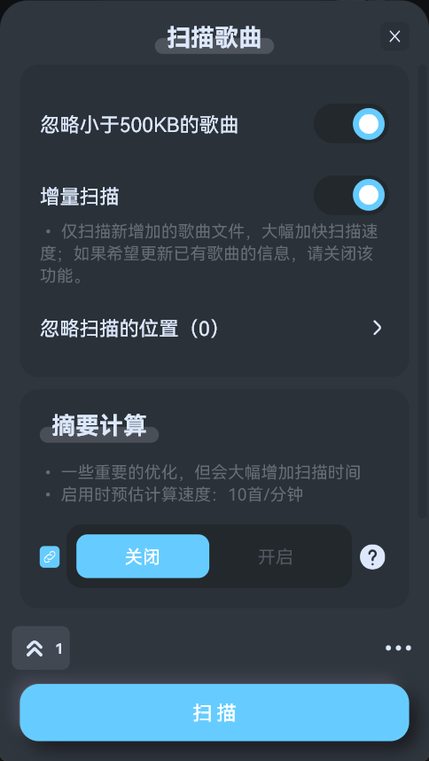
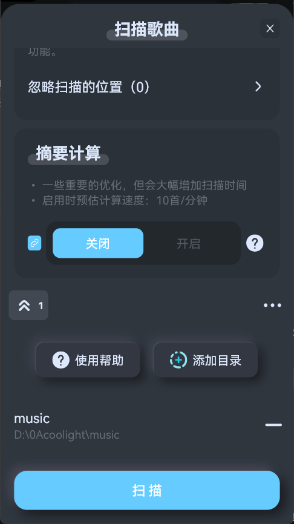
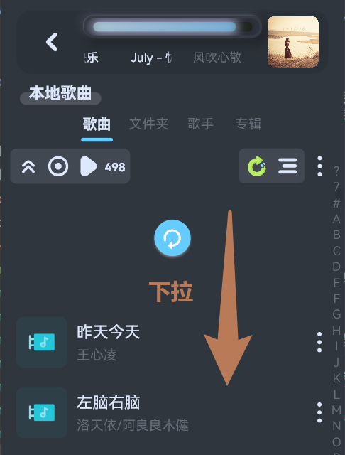
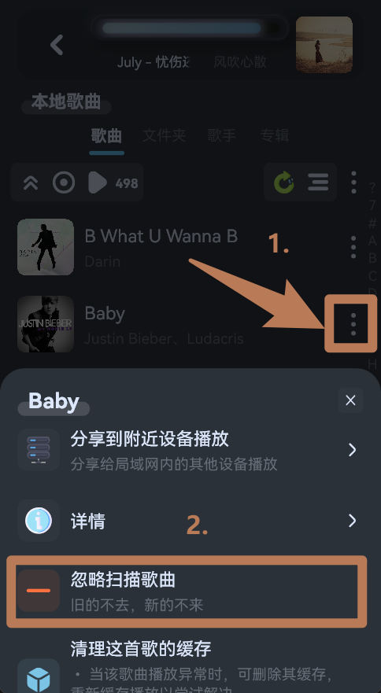
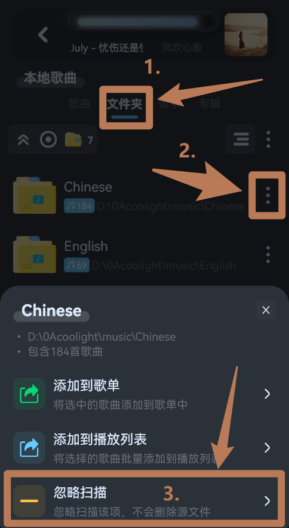
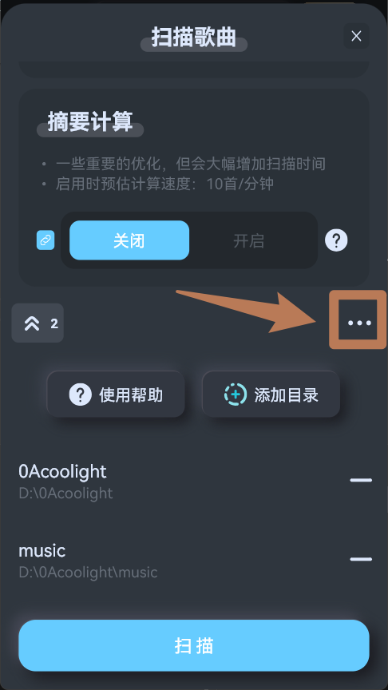
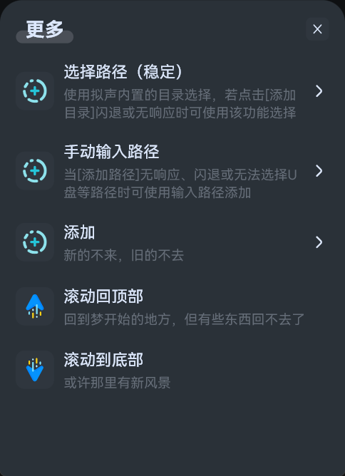
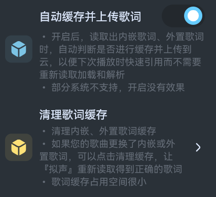

# 扫描本地歌曲

## 扫描
- 在本地歌曲列表点击右上角的扫描按钮：

- 可以看到如下弹窗：
  - **增量扫描**：针对指定目录内新增加的歌曲，读取其歌曲信息并记录进`拟声`中，并将已被删除的歌曲从`拟声`的记录中移除，打开该功能可以大幅加快扫描速度。**但不会刷新已有歌曲的信息**，因此如果您修改了歌曲信息、封面时，需要关闭该功能后重新扫描！
  - **忽略扫描的位置**：这里指定的目录或文件将被忽略扫描。
  - **扫描方式**：安卓端可选`快速扫描`或`完整扫描`：
    - **快速扫描**：扫描非常快！引用系统的文件记录，但可能缺失部分格式。
    - **完整扫描**：能扫描到的格式更多更完整，但速度慢。由拟声自行扫描和提取歌曲文件信息。需要扫描`不常见的格式`或`视频`时请选择该方式。
  - **摘要计算**：完成摘要计算的歌曲在跨设备使用时有优化，但计算过程相当缓慢！

- 弹窗底部可以指定扫描目录：
  - 默认不指定目录时自动全局扫描，这可能需要很长的时间，因此建议指定歌曲目录位置。
  - 点击`添加目录`可添加指定扫描的目录。

- 后续重新扫描时，如果不需要更改配置，可直接在本地歌曲列表`下拉`刷新扫描：

## 忽略扫描
- 如果希望忽略扫描某一歌曲，可在本地歌曲列表找到该歌曲后点击歌曲项右边的`三个点`，然后点击`忽略扫描歌曲`即可：

- 如果希望忽略扫描某一个文件夹，可切换到文件夹分类，然后点击目标文件夹右边的`三个点`，然后点击`忽略扫描`即可：

- 如果希望忽略扫描某一歌手、专辑分类，操作等同忽略扫描文件夹。

## 问题

### 点击添加目录无响应或闪退
- 若点击`添加目录`无响应或闪退，可点击列表右上角的`三个点`：

- 依次尝试`选择路径`和`手动输入路径`：

### 扫描U盘、内存卡等外部存储
- 如果默认全局扫描没有扫描外部存储的歌曲，可以添加指定U盘、内存卡上的音乐目录路径后扫描。
- 注意拔了U盘、内存卡后是播放不了的，重新插回后可能可以播放，因为系统在重新插入外部存储时其名称可能改变，导致拟声之前扫描添加的外部存储的歌曲路径失效，因此如果播放不了需要重新扫描。

### 手动输入路径
- 若无法通过系统添加路径，拟声内置的`选择路径`也没有显示U盘等外部存储时，可以先用`系统文件管理器`、`MT文件管理器`等工具复制U盘的一个音乐文件夹路径，然后回到`拟声`，[手动输入路径添加](#点击添加目录无响应或闪退)

### 扫不到文件/缺失部分格式
* 大部分时候是权限问题，您可以在`拟声设置-系统权限`中点击`文件读写`获取完整的文件访问权限，否则系统可能会限制拟声只能访问被系统认为是音视频的文件，而对于一些系统不支持的音视频（尤其是dsf等格式）拟声不能扫描到。

### 更新歌曲信息、封面
- 如果希望更改歌曲信息、封面，可使用`音乐标签`等软件修改歌曲文件的信息，然后回到`拟声`，[重新扫描](#扫描)（**注意关闭增量扫描**）

### 更新本地歌曲歌词
- `拟声`在播放本地歌曲时，如果能读取到歌曲的内置、外置歌词会自动缓存，如果您更换了歌曲的歌词，可以在`设置-歌词-清理歌词缓存`清理之前缓存的歌词，让`拟声`重新读取得到正确的歌词。

