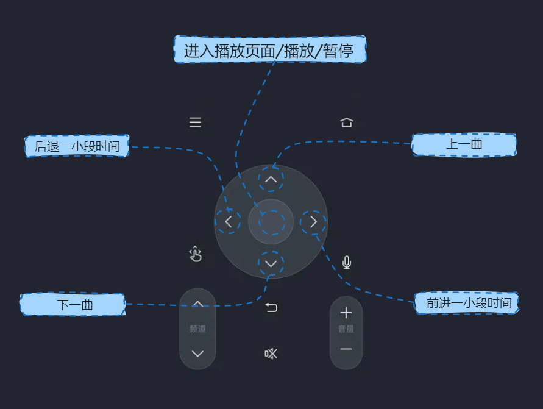
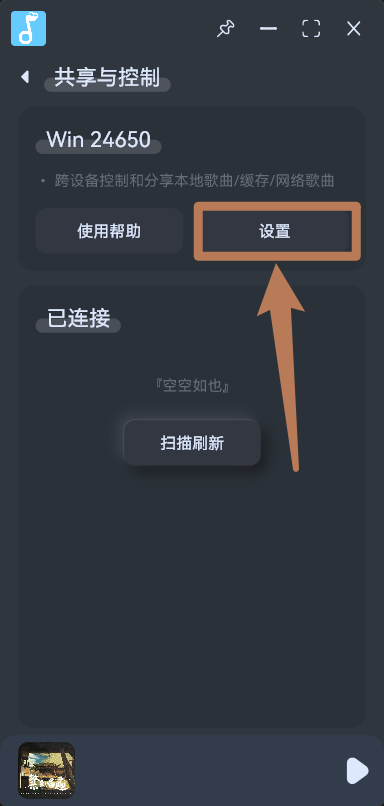
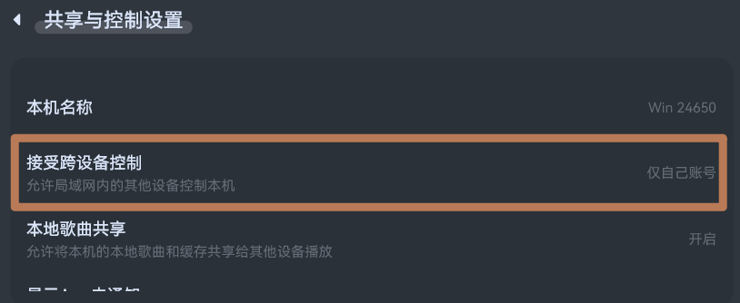
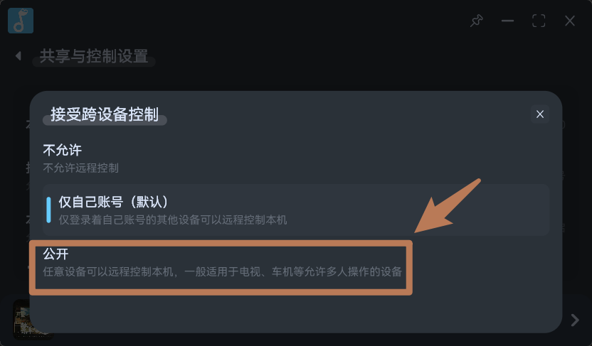

## 电视使用指南
- 拟声可以在安卓 电视机、机顶盒 上运行，支持自适应横屏，安装时与安卓手机相同选择`安卓安装包`即可。
- 但拟声仅适配了小部分遥控器功能，因此您需要使用`鼠标`或安装`共享与控制`插件后用手机、电脑控制。

## 已适配的遥控器功能

## 拟声远程控制
- 在其他设备，如手机、电脑上安装拟声，并且双方都安装插件`共享与控制`后，即可互相控制和共享歌曲。
- 对于电视您需要先使用鼠标操作，安装该插件。
- 默认情况下，`共享与控制`仅允许登录相同账号的设备可以互相控制，您可以用鼠标修改插件设置项的`接收跨设备控制`控制权限为`公开`：

- 点击`设置`：

- 点击`接收跨设备控制`：

- 选择`公开`:
