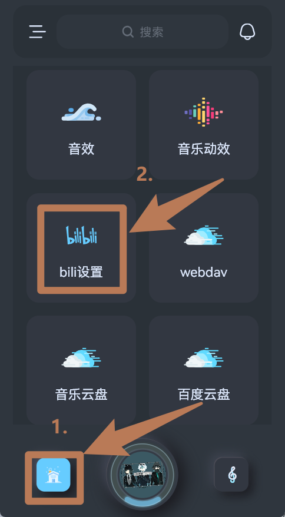
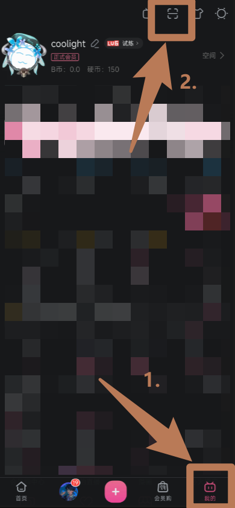

# 插件：Bilibili

> - 注意：官网下载的版本才会拥有`Bilibili`插件，应用商店下载的版本并不包含该插件！
> - 可在[下载官网]重新下载安装，在`插件`列表中即可找到`Bilibili`插件。

## 功能
- 绑定B站账号
- 搜索B站的视频和音频歌曲
- 导入Bili收藏夹
- 导入Bili视频合集
- 导入B站UP的投稿

## 绑定B站账号
- 绑定B站账号可提高播放Bili歌曲的音质、视频的画质和访问B站的稳定性。
- 在`主页`点击`Bili设置`：

- 点击扫描绑定账号

- 然后手机打开`B站客户端`扫描绑定：
