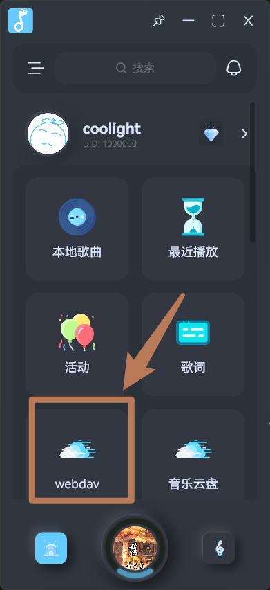
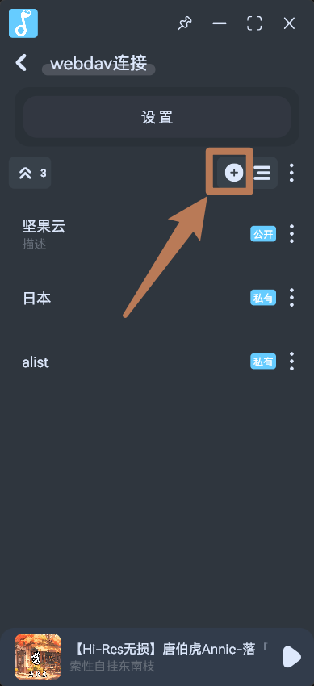
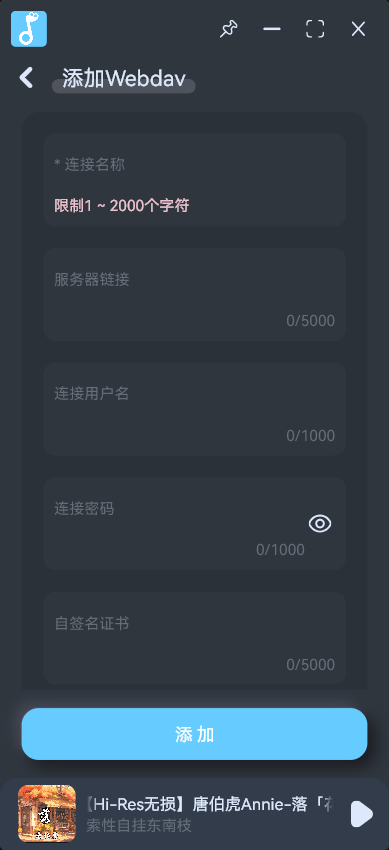
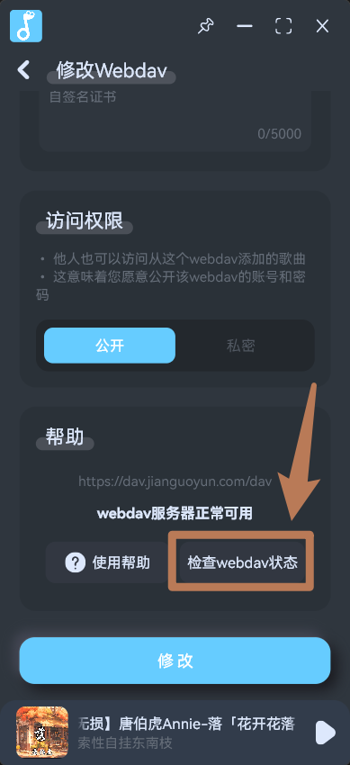

## 添加webdav连接

- 在`拟声`中安装`webdav`插件后，在主页可以进入webdav页面

- 点击右上角的添加按钮：

- 然后填入`webdav服务`的信息，这一般由您希望连接的webdav服务商提供：
  - `连接名称`：随意起名
  - `服务器链接`：webdav服务的链接，不能乱填或填错
  - `连接用户名`：webdav服务的账号名称
  - `连接密码`：webdav服务的账号密码
  - `自签名证书`：可不填，默认允许任意证书。如果您的webdav服务启用了自签名证书加密，且希望验证证书，可填入证书的一段即可，验证失败再尝试另一段。
  - `访问权限`：
    - `公开`：允许共享您的webdav连接给其他用户使用，这意味着您愿意公开您的webdav账号密码
    - `私密`：仅您的账号可使用

- 填写完成后，可滑动到底部尝试连接：
